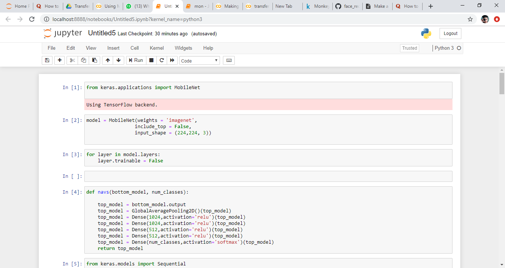
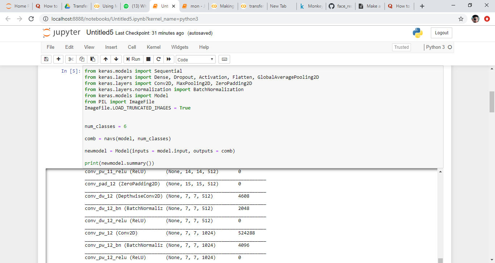
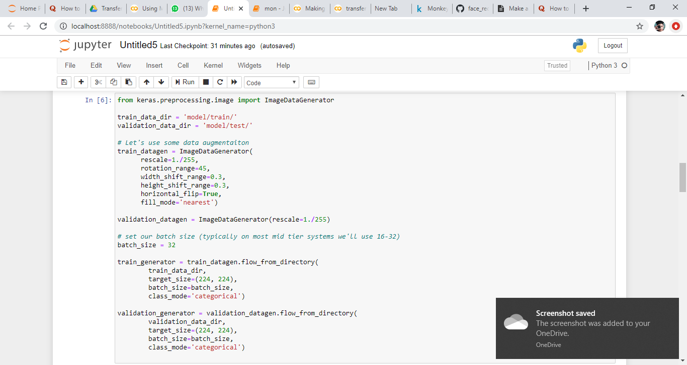
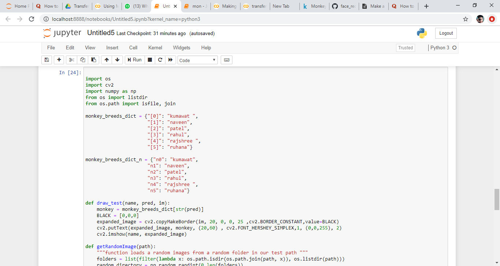

# Face Recognition

## Step 1:
All the layers are freezed except last layer or top layer or say output layer ,

## Step 2: 
The extra layers are added in the model before output layer 

## Step 3:
After adding the new layers it have to combine with previous layers,

## Step 4:
To increase the no. of images ImageDataGenerator is used

## Step 5:
Compilation and fitting process

## Step 6: 
By using dictionary dataset names given to all the classes 

## Step 7:
Taking random images from test folder

## Step 7:
By using the cv2 library images are shown and text putted on predicted images

